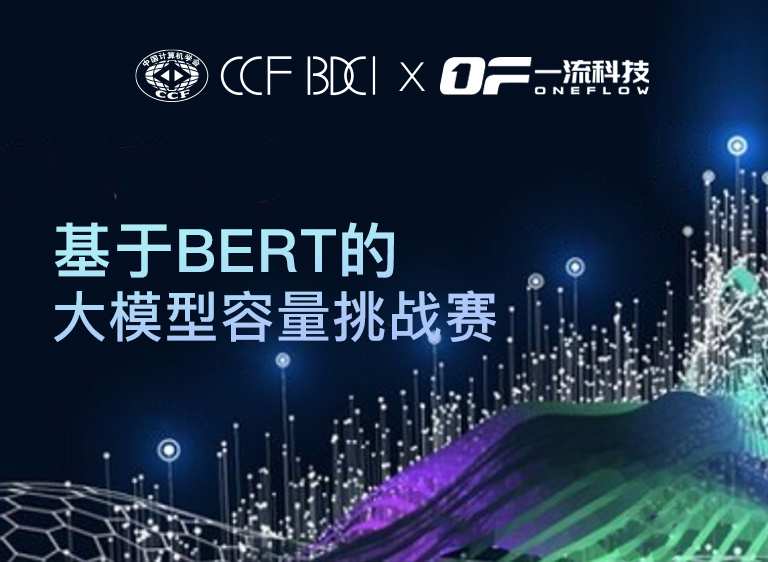
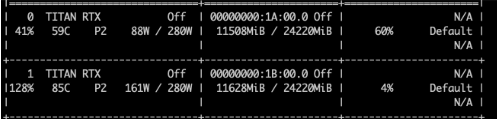

# 2021_CCF_BDCI_LargeBERT_Rank1st

This repository is the winning solution to 2021 CCF Big Data & Computing Intelligence Contest (2021 CCF BDCI) - "[Large BERT Training Challange Cup](https://www.datafountain.cn/competitions/538)".

Team: PKU-DAIR. Members: Xupeng Miao, Xiaonan Nie, Yujie Wang.

Our Hetu team members have won both 1st and 3rd in the contest. And this solution is based on PyTorch and achieves the hidden size of 2080. We also provide an [implementation](https://github.com/PKU-DAIR/Hetu/tree/ccfbdci2021/examples/nlp/bert) over [Hetu distributed deep learning system](https://github.com/PKU-DAIR/Hetu/), which achieves an amazing hidden size of 2128!

<p align="center">



</p>

## Environment

+ python=3.6.13

## Usage

```shell
./train.sh
```

## Results

<p align="center">

</p>


